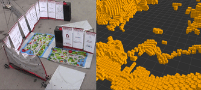
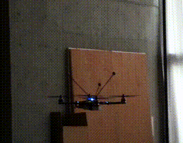

Hi! I am a Research Scientist in the [Robotics Research Lab](https://www.nvidia.com/en-us/research/robotics/) at NVIDIA Research led by Dieter Fox. Previously, I received my Ph.D. from the [Robotics Institute](https://www.ri.cmu.edu/) at Carnegie Mellon University. I obtained my B.A.Sc. in [Engineering Science](https://engsci.utoronto.ca/program/what-is-engsci/) from University of Toronto, with a major in [Aerospace Engineering](http://www.utias.utoronto.ca/) and a minor in Robotics and Mechatronics.

I am interested in reasoning about human intention and behavior given arbitrary task spaces for the purposes of motion planning. Previously, I worked on human intention modeling and prediction for continuous human-in-the-loop control of mobile robots, and agile safe navigation in unknown and unstructured environments.

You can contact me at xuningy at gmail dot com.

### Thesis
1. [**Human-in-the-loop Planning for Mobile Robots**  ](https://www.ri.cmu.edu/publications/human-in-the-loop-planning-of-mobile-robots/)   
*PhD Thesis, Robotics Institute, Carnegie Mellon University, Jan 2022*   
\[[bibtex](bibtex/phd-thesis.txt)\]
\[[pdf (33.4MB)](/papers/thesis.pdf)\]
\[[talk](https://youtu.be/0qSzzafpmxo)\]

### Publications

1. **Continuous Dynamic Autonomy via Path Prediction on Semantic
Topological Maps**  
**Xuning Yang**, Jean Oh  
*Submitted to the International Conference on Intelligent Robots and Systems (IROS), 2022*  
\[[pdf](/papers/iros22.pdf)\]
\[[video](https://youtu.be/NLy9elUA81E)\]

2. [**An Intention Guided Hierarchical Framework for Trajectory-based Teleoperation of Mobile Robots**](https://ieeexplore.ieee.org/document/9561798)  
**Xuning Yang**, Jasmine Cheng, and Nathan Michael  
*International Conference on Robotics and Automation (ICRA), 2021*  
\[[bibtex](bibtex/icra21.txt)\]
\[[pdf](/papers/icra21.pdf)\]
\[[code](https://github.com/xuningy/planning_arch)\]
\[[talk](https://youtu.be/XNVsO4b2sw4)\]
[<a class="gif-link" id="icra21">gif</a>]

3. [**An imminent collision monitoring system with safe stopping
interventions for autonomous aerial flights**](/papers/icra21-ws.pdf)  
Jasmine Cheng,  **Xuning Yang**, and Nathan Michael  
*ICRA 2021 Workshop on "Resilient and Long-Term Autonomy for Aerial Robotic Systems", Spotlight Talk*  
\[[bibtex](bibtex/icra21-ws.txt)\]
\[[pdf](/papers/icra21-ws.pdf)\]
<!-- \[[video](https://youtu.be/Tulya5WtB_Y)\] -->

4. [**Assisted Mobile Robot Teleoperation with Intent-aligned Trajectories via Biased Incremental Action Sampling**](https://ieeexplore.ieee.org/document/9341514)  
 **Xuning Yang** and Nathan Michael  
*International Conference on Intelligent Robots and Systems (IROS), October 2020*  
\[[bibtex](bibtex/iros20.txt)\]
\[[pdf](/papers/IROS20.pdf)\]
\[[code](https://github.com/xuningy/motion_primitive_tree)\]
\[[talk](https://youtu.be/Tulya5WtB_Y)\]
[<a class="gif-link" id="iros20">gif</a>]

5. [**Fast and Agile Vision-Based Flight with Teleoperation and Collision Avoidance on a Multirotor**](https://arxiv.org/abs/1905.13419)  
Alexander Spitzer\*, **Xuning Yang\***, John Yao, Aditya Dhawale, Kshitij Goel, Mosam Dabhi, Matt Collins, Curtis Boirum, and Nathan Michael  
*International Symposium on Experimental Robotics (ISER), November 2018*  
\[[bibtex](bibtex/iser18.txt)\]
\[[pdf](/papers/ISER18.pdf)\] \[[video](https://www.youtube.com/watch?v=_-KmGhP0HTQ)\]
[<a class="gif-link" id="vibworld">sim</a>/<a class="gif-link" id="hsv">real</a> gifs]

<!-- [<a class="gif" href="#">gif</a>] -->

6.  [**Reactive Collision Avoidance using Real-Time Local Gaussian Mixture Model Maps**](https://ieeexplore.ieee.org/document/8593723)  
Aditya Dhawale, **Xuning Yang**, and Nathan Michael  
*International Conference on Intelligent Robots and Systems (IROS), October 2018*  
\[[bibtex](bibtex/iros18.txt)\]
\[[pdf](/papers/IROS18.pdf)\]
[<a class="gif-link" id="iros18">gif</a>]

7. [**Online adaptive teleoperation via motion primitives for mobile robots**](https://link.springer.com/article/10.1007/s10514-018-9753-2)  
**Xuning Yang**, Ayush Agrawal, Koushil Sreenath, and Nathan Michael  
*Special Issue on Learning for Human-Robot Collaboration, Autonomous Robots, April 2018*  
\[[bibtex](bibtex/auro18.txt)\]
\[[pdf](/papers/AURO18.pdf)\]

8. [**A Framework for Efficient Teleoperation via Online Adaptation**](https://ieeexplore.ieee.org/document/7989701)  
**Xuning Yang**, Koushil Sreenath, and Nathan Michael  
*International Conference on Robotics and Automation (ICRA), May 2017*  
\[[bibtex](bibtex/icra17.txt)\]
\[[pdf](/papers/ICRA17.pdf)\]
[<a class="gif-link" id="icra17">gif</a>]

9.  [**Online Adaptive Teleoperation via Incremental Intent Modeling**](https://dl.acm.org/doi/10.1145/3029798.3038370)  
**Xuning Yang**, Koushil Sreenath, and Nathan Michael  
*Late Breaking Report, International Conference on Human-Robot Interaction (HRI), March 2017*  
\[[bibtex](bibtex/hri17.txt)\]
\[[pdf](/papers/HRI17-LBR.pdf)\]

<!-- ### Talks

1. Invited talk: Toward intuitive human controlled MAVs: motion primitives based teleoperation  
*IROS 2018 workshop: Vision based Drones: What's Next?* -->

### Other projects

1. In-place hover-to-hover flip of a quadrotor, featured in [Rapyuta Robotics Ltd. Teaser video](https://www.youtube.com/watch?v=zqp2Z2hbOFU-)  
[<a class="gif-link" id="flip">gif</a>]

### Robots
I enjoy building robots. Some of the robots that are near and dear to my heart are listed here.


  

      
      
    

